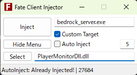

# bun-proxy

YAML設定ファイルを使用したBunベースのTCP/UDPフォワーダー。

使用方法:

- Bunがインストールされていることを確認してください。
- 依存関係（TypeScript/Nodeタイプを含む）をインストールし、実行します:
```
bun install
bun index.ts
```
または `bun run start`。
- 初回実行時に、同じディレクトリに `config.yml` が生成され、サンプルルールが含まれます。

設定例:

```yaml
endpoint: 6000
useRestApi: false
listeners:
  - bind: 0.0.0.0
    tcp: 25565
    udp: 25565
    haproxy: false
    webhook: ""
    target:
      host: localhost
      tcp: 5000
      udp: 6000
```

これは、0.0.0.0:8000でTCPをリッスンし、127.0.0.1:9000にプロキシし、同様にUDP 8001 -> 9001を行います。

注意: リスナールールで `haproxy: true` を設定することで、HAProxy PROXY Protocol v2を有効にできます。
有効にすると、プロキシは各TCP接続**および**クライアントセッションごとの最初のUDPパケットに対してPROXY v2ヘッダーを送信します。宛先はPROXY Protocol v2をサポートする必要があります。


## Download

ダウンロードは[リリースページ](https://github.com/gamelist1990/BunProxy/releases)にあるので、そこから最新のビルドをダウンロードしてください。


## 使い方 (動画)

[](https://www.youtube.com/watch?v=VIDEO_ID)

- RESTAPI を使用する場合は、`useRestApi: true` にしてください

- Discord Webhook URL を設定することで、接続ログを Discord に送信できます

- RREST API は基本Port**6000**でリッスンします。`endpoint` で変更可能です

## REST API 使用例

## サーバー側からプレイヤー接続を通知

```
curl -X POST http://localhost:6000/api/login \
  -H "Content-Type: application/json" \
  -d '{"timestamp": '$(date +%s000)', "username": "Steve"}'
```

## プレイヤー退出を通知

```
curl -X POST http://localhost:6000/api/logout \
  -H "Content-Type: application/json" \
  -d '{"timestamp": '$(date +%s000)', "username": "Steve"}'
```


# Bedrock Dedicated Server Dll

Bun Proxy は Bedrock Dedicated Server 用の Dll を提供しています。これにより、サーバーが起動したときに自動的にプレイヤーのログイン/ログアウトを Bun Proxy に通知できます。

Dll のダウンロードは [リリースページ](https://raw.githubusercontent.com/gamelist1990/BunProxy/refs/heads/main/asset/PlayerMonitorDll.Dll)


## 使用方法
0. Bedrock Dedicated Server を起動しておきます。
1. 上記のリンクから `PlayerMonitorDll.Dll` をダウンロードします。
2. https://github.com/fligger/FateInjector/releases/tag/1.0 から FateInjector をダウンロードします。
3. FateInjector を使用して、`PlayerMonitorDll.Dll` を Bedrock Dedicated Server に注入します。

4. Selectで  **PlayerMonitorDll.Dll** を選択します。
5. Custom Target で**bedrock_server.exe**を選択し、Inject をクリックします。(Auto Injectでもいいです)
6. BunProxyを起動する前に `config.yml` の `useRestApi` を `true` に設定してある事を確認して下さい、またDiscordに通知を送りたい場合はwebhook URLも設定して下さい。
7. Bun Proxy を起動します。
8. プレイヤーがサーバーに接続または切断すると、Bun Proxy が自動的に通知を受け取りDiscordに通知を送信します。(webhook URLを設定していない場合はコンソールにログが表示されます)

